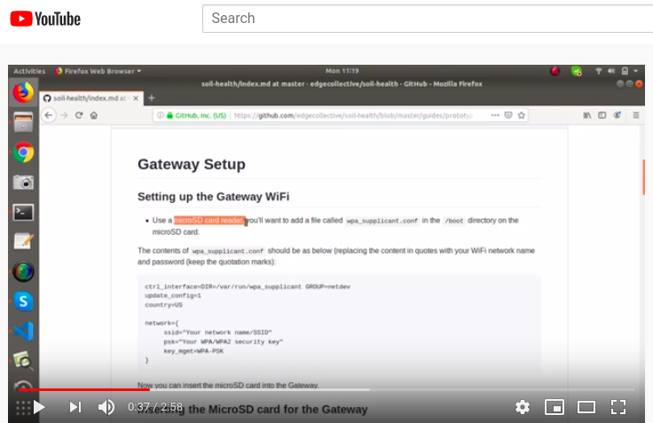
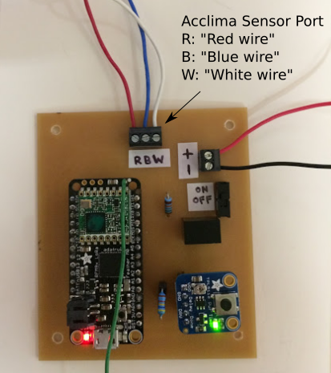
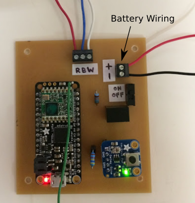
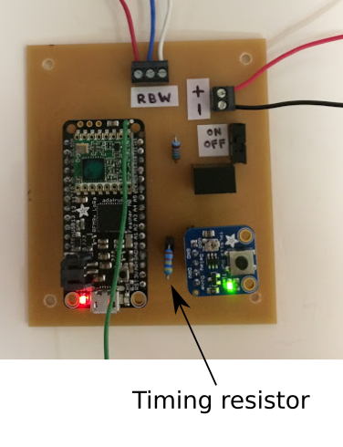
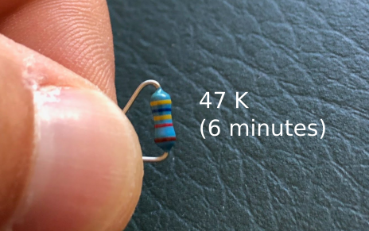
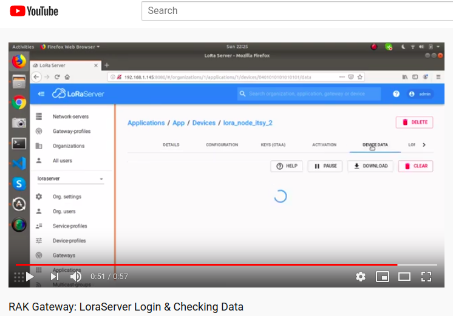
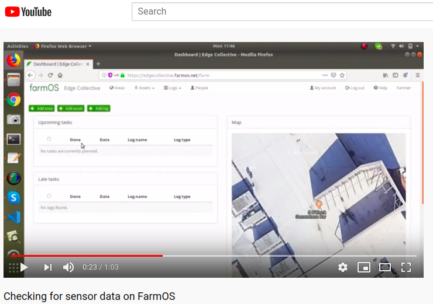
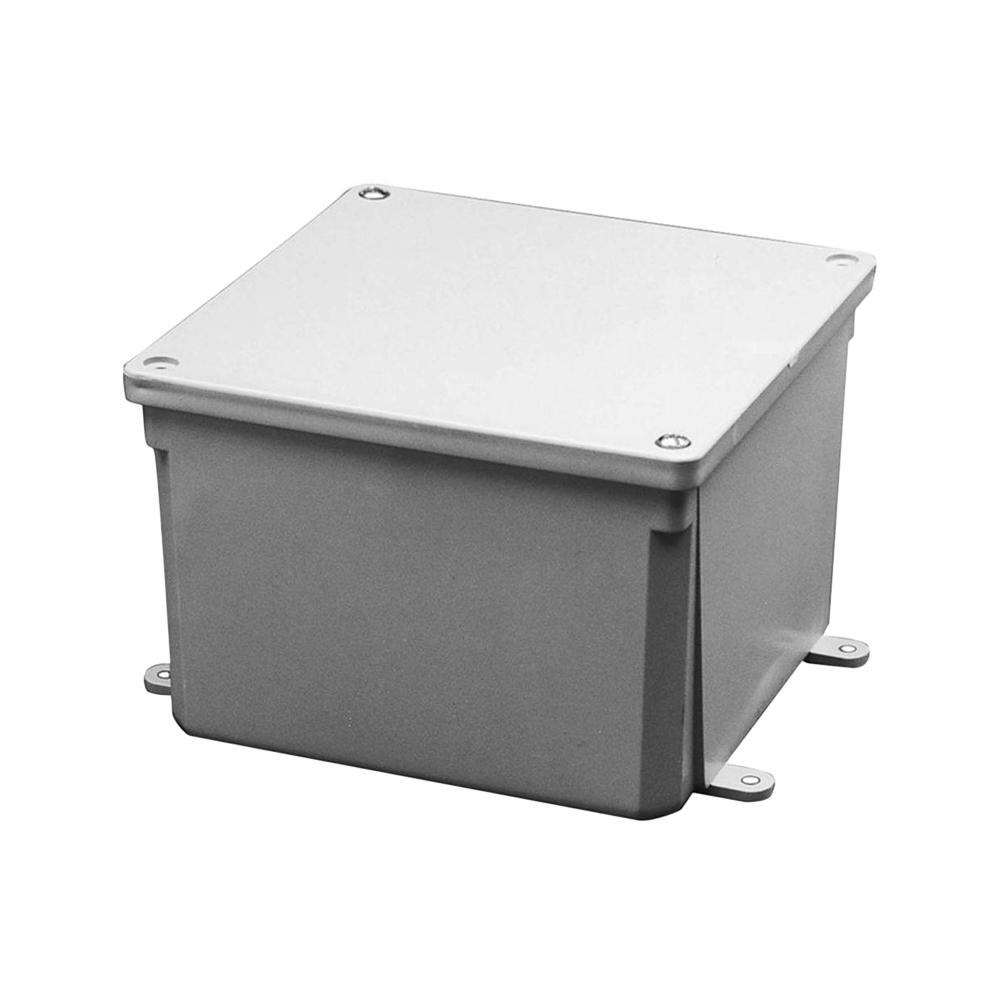
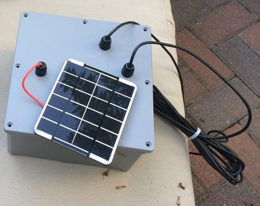

# Gateway Setup

## Setting up the Gateway WiFi

- Use a microSD card reader, you'll want to add a file called ```wpa_supplicant.conf``` in the ```/boot``` directory on the microSD card.

The contents of ```wpa_supplicant.conf``` should be as below (replacing the content in quotes with your WiFi network name and password (keep the quotation marks):

```
ctrl_interface=DIR=/var/run/wpa_supplicant GROUP=netdev
update_config=1
country=US

network={
     ssid="Your network name/SSID"
     psk="Your WPA/WPA2 security key"
     key_mgmt=WPA-PSK
}
```
Now you can insert the microSD card into the Gateway.

> **Note**: once the Gateway powers up, it copies the contents of ```wpa_supplicant.conf``` to an internal configuration file, and erases it from the /boot directory. (So don't be alarmed if the the ```wpa_supplicant.conf``` file is missing from ```/boot``` if you check after powering up). If you need to change the wifi configuration again (due to error, or change in wifi credentials), you'll need to create a new wpa_supplicant.conf file in ```/boot```.  

Here's a [video](https://www.youtube.com/watch?v=ZCZ4yxSHUO0) describing these steps:

<a href="https://www.youtube.com/watch?v=ZCZ4yxSHUO0"></a>

## Inserting the MicroSD card into the Gateway

https://photos.app.goo.gl/qJAYhq7QZsEPrEFv9

## Power on the Gateway

Using the switch on the power cord.

## Getting the Gateway IP Address

Once the Gateway has been powered up for about 30-60 seconds, it should connect to the wifi network, and it should receive an IP address from your wifi router automatically.  We'll need this IP address in order to access the gateway configuration and look at incoming data. 

Finding the gateway's IP address is perhaps easiest using the ['Fing' smartphone app](https://www.fing.com/products/fing-app), which scans your local wifi network and gives you IP addressses of devices connected to your router.

Fing is available for [Android](https://play.google.com/store/apps/details?id=com.overlook.android.fing&hl=en_US) and [iPhone](https://apps.apple.com/us/app/fing-network-scanner/id430921107).  A brief guide to using it is [here](https://lifehacker.com/ios-android-app-of-the-week-fing-network-scanner-1825205516).

## Preparing to check for data on the Gateway

Noting the IP address of the gateway (via the above procedure), now use a browser on a PC connected to your wifi network to navigate to ```[gateway IP address]:8080```.

For example, if the IP address of your gateway was ```192.168.2.145```, you would enter ```192.168.2.145:8080``` into your browser navigation bar.

You should be presented with a page asking for username and password.

```username: admin```

```password: admin```

Here's a [video](
https://youtu.be/IIaKVIXJb1M) of logging into the Gateway and checking for incoming data: 

<a href="https://youtu.be/IIaKVIXJb1M"></a>

# Remote Node Setup

## Wiring


The Acclima sensor is connected at the top of the board via a screw terminal labeled "R B W" (for "Red wire", "Blue wire", "White wire"):



The battery (you can use any battery from 6.5 Volts to 12 Volts) is wired on the port labeled "+ -":



## Timer Configuration via Resistor

The amount of time the remote node spends during its sleep cycle is controlled by the value of a "timing resistor" on the board, which can be replaced by hand:



A few resistors have been included in the kit with some typical timing values:




## Remote Node Measurement Cycle


Video of a successful power-up and shut-down is [here](
https://photos.app.goo.gl/qXKK1zMYpoje4MXd6). 


Below is an explanation of the various elements of the power-up and shut-down sequence.


### Successful sequence:

1. **Powerup**. Timer chip LED (green) is on.  Feather led (red) is on for a few seconds.

2. **Feather bootup**. Feather LED (red) blinks **once**, slowly.

3. **Soil moisture measurement**.  Feather LED (red) blinks **three times** if the Acclima soil moisture sensors are successfully read.

4. **Gateway acknowleges transmission, and Remote sleeps**.  The Feather now sends data to the Gateway.  If it receives a message from the Gateway indicating success, then the timer chip LED (green) will turn off, indicating that the remote node is now sleeping.

### Troubleshooting

- **Timer LED (green) does not turn off**. If all other Feather LED (red) patterns seem successful, but the Timer LED (green) does not turn off, this means that the Remote Node has not been able to send data to the Gateway.  This could be because the Gateway is out of range, or because the Gateway is malfunctioning.  

# Checking for Successful Data Flow

## On the Gateway

This is just a matter of waiting for data to flow through on the final web page that one navigated to in the above section on setting up the gateway.  It corresponds to the end point of the above video -- also linked (at the appropriate timestamp) [here](https://youtu.be/IIaKVIXJb1M?t=51):

<a href="https://youtu.be/IIaKVIXJb1M?t=51"></a>

## On FarmOS

You can check the sensor data on FarmOS by using your login and password at edgecollective.farmos.net -- the below [video](https://youtu.be/Amo0gwSLSl8) shows you how:

<a href="https://youtu.be/Amo0gwSLSl8"></a>

(TODO: Note about battery level)

# Testing Remote Login to Gateway

# Remote Node Enclosures

I've been using various sizes of PVC electrical junction boxes at Home Depot, and drilling necessary holes in them:

<a href="https://www.homedepot.com/p/Carlon-6-in-x-6-in-x-4-in-Gray-PVC-Junction-Box-Case-of-3-E987RR/202206112?MERCH=REC-_-pipsem-_-NA-_-202206112-_-N"></a>

One can then use plastic cable 'glands' to make cable 'pass-throughs' that are water-resistant:

<a href="https://www.amazon.com/gp/product/B06Y5HGYK2/ref=ppx_yo_dt_b_asin_title_o01_s00?ie=UTF8&psc=1"></a>

Here's an example of such an enclosure with two cable glands for sensor cables, and one for a solar panel:



# References

- Gateway docs
- Arduino Libraries


