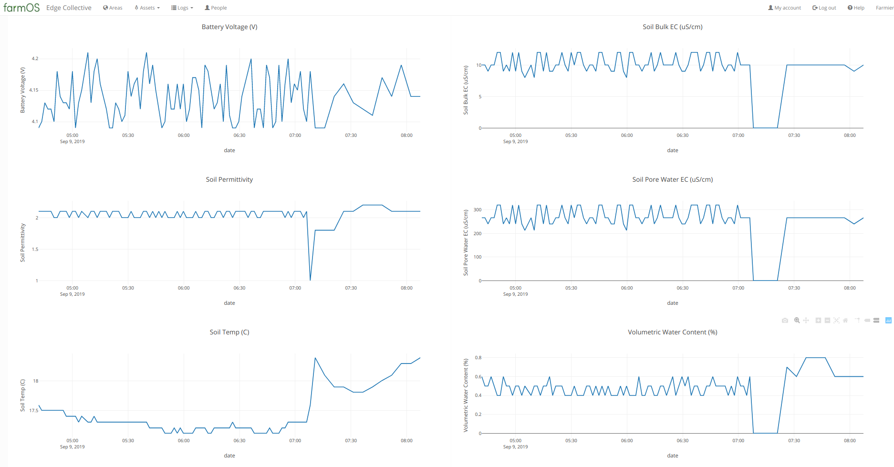

# Update #1

**Figure 1**:  Probe initially in potted plant soil.  Removed probe for a few minutes (got “zero” readings for the soil moisture parameters, as expected), then replaced in soil.  Note that initial readings are “zero” for soil moisture parameters -- likely because potted plant soil was so dry and porous.  After readjusting the probe in the soil, readings returned to approximately their previous values. 

## Remote Node

- Combined LoRa code with SDI-12 code
- Encoding parameters from lora node into byte payload, decoding on Gateway

## Gateway

- Remote connection setup to boot automatically 
- Internet connection allows wireless or ethernet cable
- If possible, easier to start with ethernet cable to test remote connectivity, set up parameters
Software set up on gateway to parse incoming lora packets and send to FarmOS, with parameter names

## Next steps:

- Build remote node hardware setup for initial deployment
- Enclosure
- Battery
- Finalize initial version of gateway software
