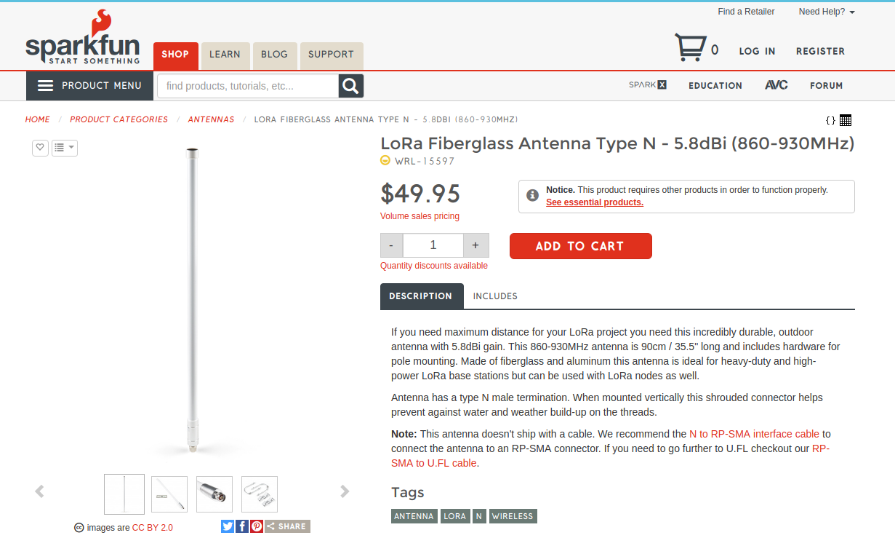
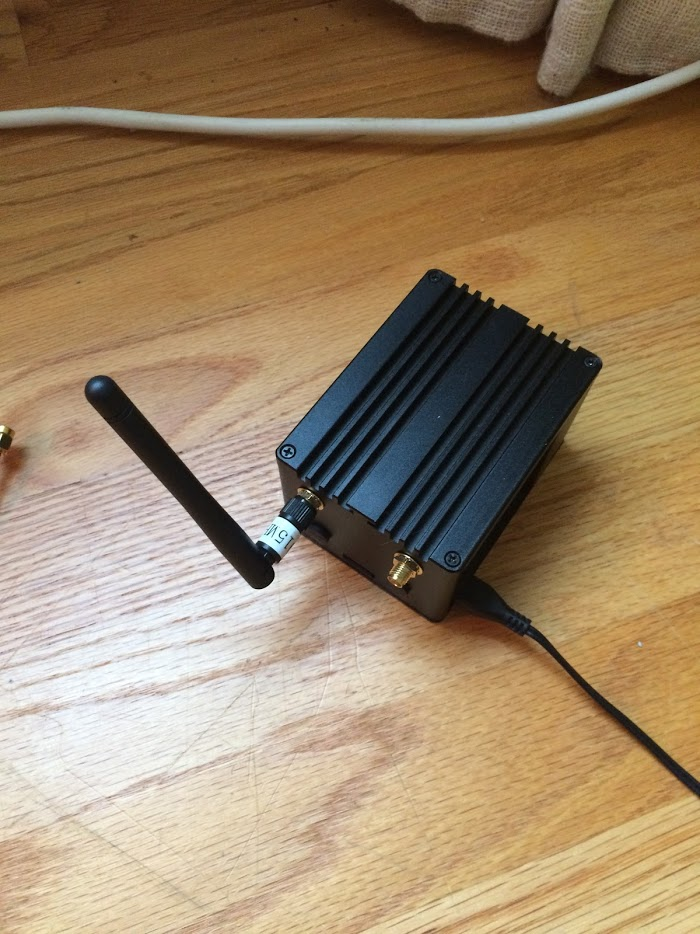
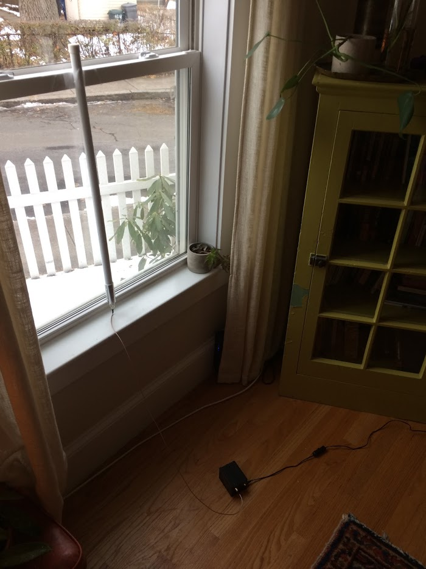
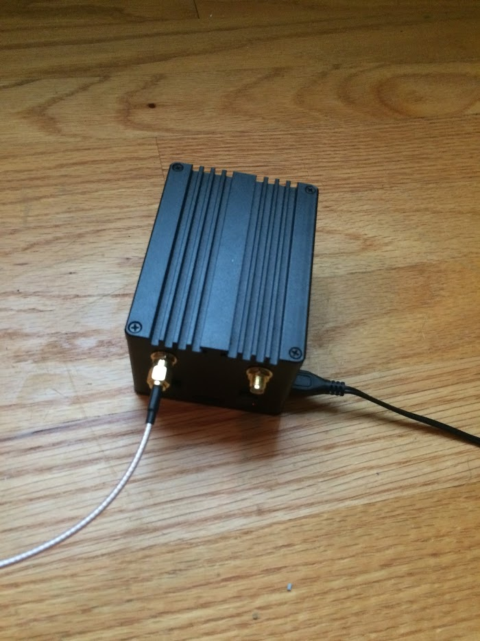
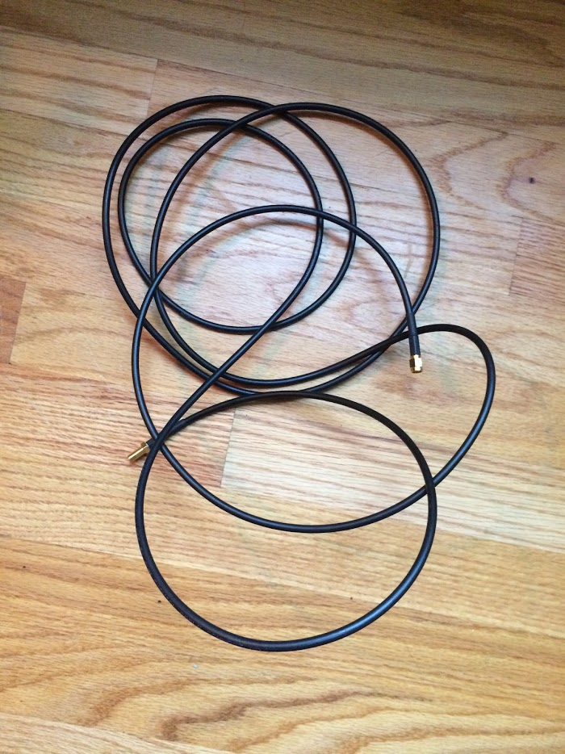
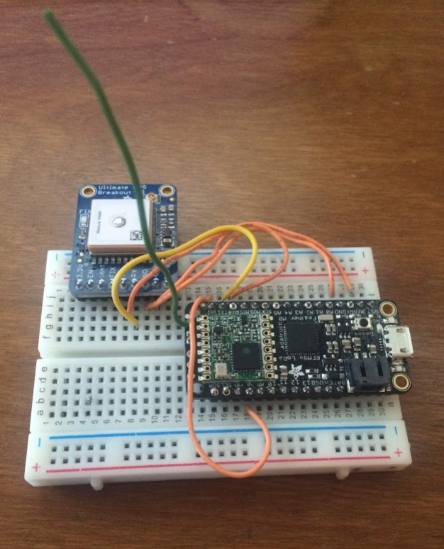
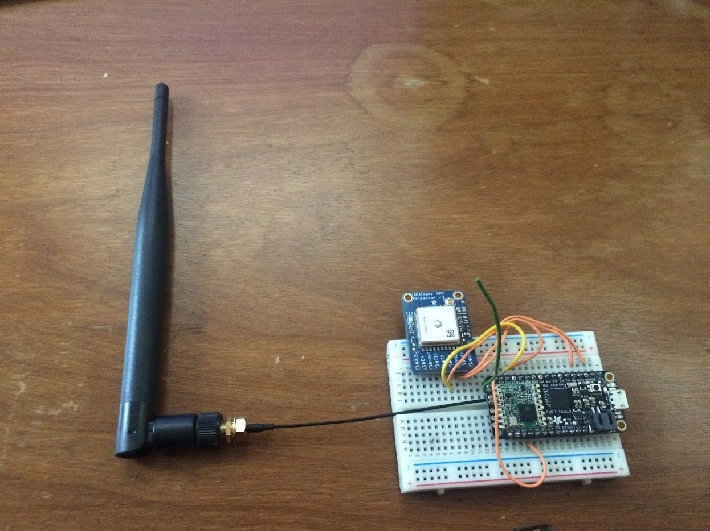
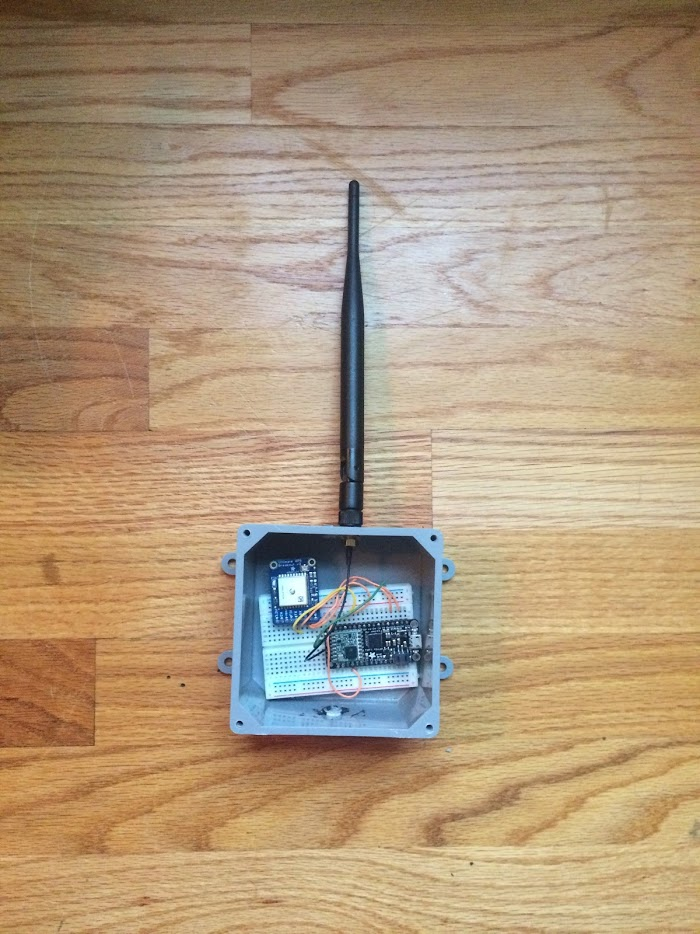
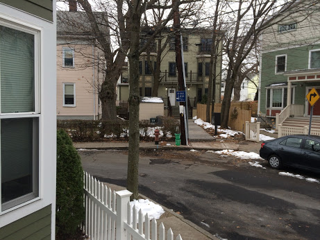
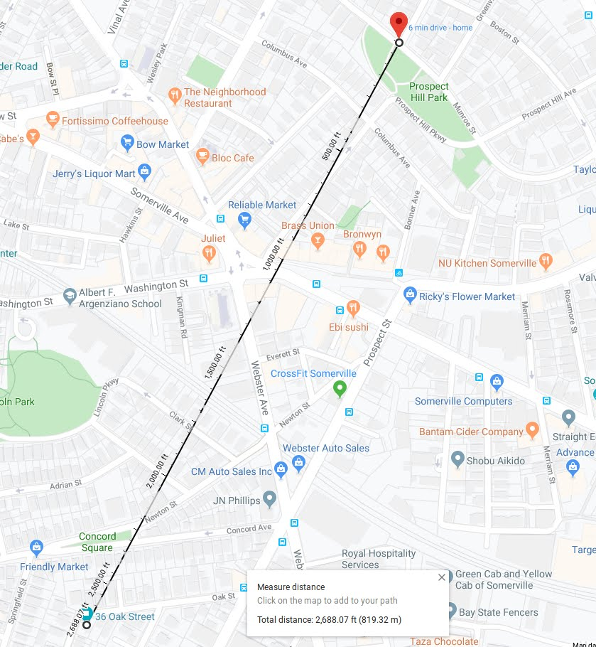

# Update 12/6/2019

## Previously:

- Remote node acquiring data from Acclima sensor and relaying to gateway
- Gateway posting data to FarmOS and Google Sheets
- Remote login to Gateway (works at Patrick's house but not David's)

## Current todo:

- Improve radio range
- Assess battery performance of remote node
- Redesign remote node so easy to produce at scale

## Notes on current status

A few months ago, Patrick was able to use the system to perform some basic tests of the Acclima sensor in a bucket of soil, posting data to FarmOS and to Google Sheets.  This seemed to prove out the basic system;  however, the radio range for the device was insufficient for the intended application.  

Don did some research and found that this was because, unlike earlier rough prototypes he'd made (which easily had a range of 2+ miles in lightly wooded forest), the current 'professional' gateway + software system we're using (which is necessary in order to have a gateway that communicates with more than a few remote nodes) is designed to operate well within FCC guidelines for transmission power.  When one looks at typical deployments of these gateway systems, most of them avoid using the small antenna that comes with gateway, and instead are using an external antenna -- mounted to a high point, ideally within line-of-sight of the remote nodes.  

Fortunately, another (academic conservation biology) project that spun up for Don recently involves using the same LoRa system, and he was given one of these external fiberglass LoRa antennas ($50, from Sparkfun):

So, Don took the original gateway setup -- which used a much smaller antenna:

... and replaced it with the larger, external antenna:

Note that such antennas would typically not be located in a window, but mounted externally, on a roof, using extension coaxial cables like this:

In order to test transmission range, Don put together a prototype using the same microcontroller as in our Acclima prototype, but with a GPS sensor attached:

Don plans to use this system to test the maximum range for the new external antenna.  Note that we will also be adding a ($10) antenna to the remote node to replace the simple wire antenna, which should also help to improve the range:

 

 

Within the next week or so, Don plans to take the system to a location with extended line-of-sight to see if he can determine a maximum range of radio transmission.

### Preliminary range test 

As a preliminary test, Don tried assessing the range in his local neighborhood. (Don is located in an urban area where line-of-sight is limited.) 

**Setup**. On the remote side, he used the simple wire antenna as in the original Acclima prototype.  On the gateway side, he set up the lora external antenna in his apartment window, as shown above.  

**Location**. Don's apartment is located on a dense urban street:

 

In order to attempt to get a long-distance, somewhat-line-of-sight connection, Don took the remote node with GPS receiver to the highest local point near his apartment:  Prospect Tower:

 

He was easily able to transmit his GPS location from Prospect Tower to his home location, a distance of about 2700 feet. 

 

The 'RSSI' (a measure of signal strength) was about -120 dB (not the best, but not the worst.  And this is with a simple wire antenna on the remote node, and many houses and trees in between the remote node and the gateway).  

